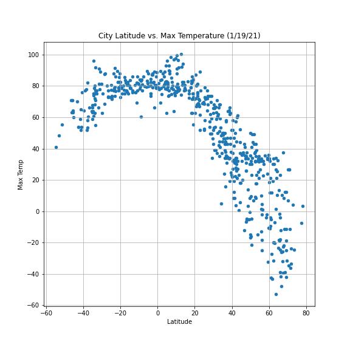
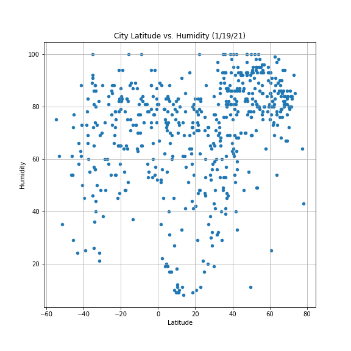

# Python-API-Challenge
Utilization of python API's to look at weather data
  This repository contains two notebooks. The first notebook utilizes information from OpenWeather to track changes in weather based on location in the world. 627 cities were randomly selected throughout the world. For each city, the max temperature, the humidity levels, the cloudiness levels, and wind speeds were recorded. The values recoreded also reflected how the weather in that particulary city would look like on January 21st, which is the day on which the API was used to get the weather information for all cities. After getting the data from all the cities from OpenWeather, the next objective was to find relationships between latitude, max temperature, humidity, cloudiness, and windspeed in order to visualize how weather changed based on location. Below are pictures of each of the four plots.

  

  
  
  The second notebook takes the weather data from the first notebook and utilizes it for the purpose of vacation planning. The first step was taking the complete weather data and narrowing down this dataset to just show data for the cities which met the conditions for "ideal weather".(This was max temp between 70 and 80,  zero clouidness, and wind speed of 10 mph or less.) The next objective was to find the nearest hotel to each of these cities (determined as closest hotel to the cities latitude and longitude coordinates on google maps) and put them on a map so that the users could see where they are in the world. The maps also shows intensity of humidity in cities around the world based on color. All data gathered for this notebook came from GoogleMaps. 
