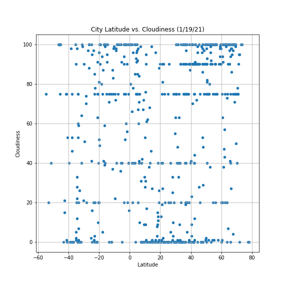
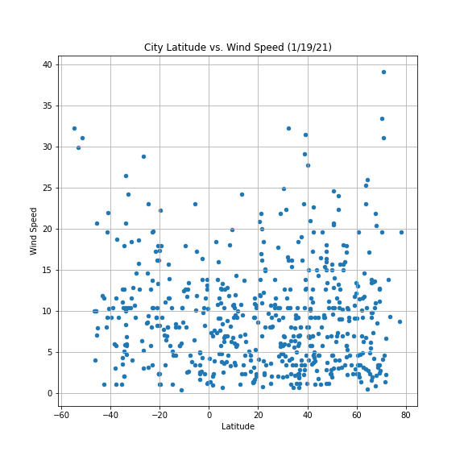
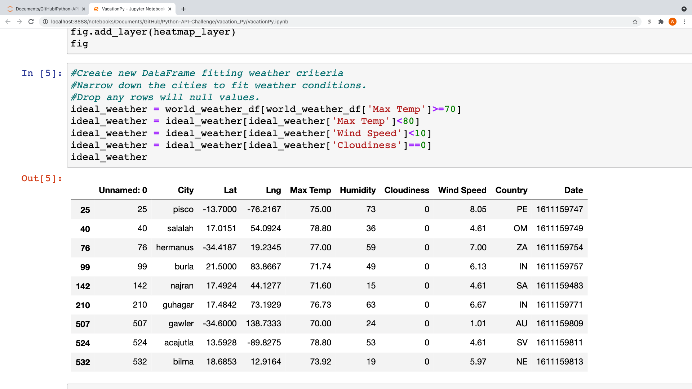
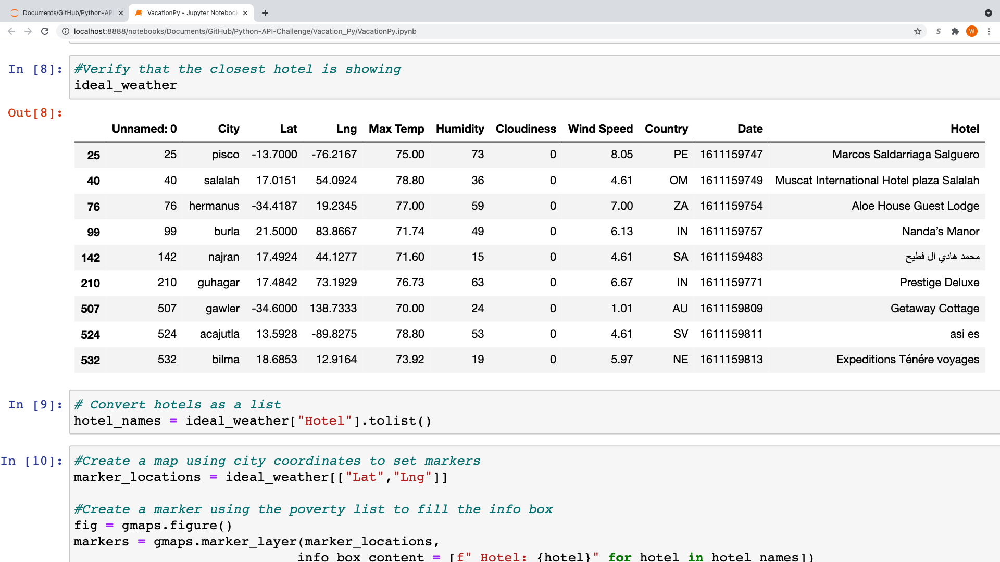

# Python-API-Challenge
Utilization of python API's to look at weather data
  This repository contains two notebooks. The first notebook utilizes information from OpenWeather to track changes in weather based on location in the world. 627 cities were randomly selected throughout the world. For each city, the max temperature, the humidity levels, the cloudiness levels, and wind speeds were recorded. The values recoreded also reflected how the weather in that particulary city would look like on January 21st, which is the day on which the API was used to get the weather information for all cities. After getting the data from all the cities from OpenWeather, the next objective was to find relationships between latitude, max temperature, humidity, cloudiness, and windspeed in order to visualize how weather changed based on location. Below are pictures of each of the four plots.

   
  
  
  

  After looking at the plots of the 4 elements of the weather examined above, only max temperature seems to be related to latitude. As one would logically expect, the max temperature of the given cities significantly increases as we get closer to the equator (which is located at a Latitude of 0 degrees). The hottest temperatures that we see on plot occurr around this latitude mark. Another interesting trend is that the cities in the Southern Hemisphere tend to have higher temperatures than the cities in the northern hemisphere this time of year (early January). Even the coldest cities in the southern hemisphere are much warmer than many of the cities in the northern hemisphere. 
  
  The second notebook takes the weather data from the first notebook and utilizes it for the purpose of vacation planning. The objective of this notebook was to find the cities with the best weather and recommend a hotel for guests to stay at who wish to visit these cities. The first step was taking the complete weather data and narrowing down this dataset to just show data for the cities which met the conditions for "ideal weather".(This was max temp between 70 and 80,  zero clouidness, and wind speed of 10 mph or less.) Below one can see a dataframe showing the cities that met these criteria.

  

  The next objective was to find the nearest hotel to each of these cities (determined as closest hotel to the cities latitude and longitude coordinates on google maps) and put them on a map so that the users could see where they are in the world. Below one can see a dataframe listing the closest hotel to the city center determined by its coordinates on google maps.

  

  And finally, below is a world map showing the locations of each of the cities that met the parameters for ideal weather, included with the closest hotel, along with a heatmap layer that will show the most humid areas on earth at the given date.

  
